# Linux Fundamentals

### File System Navigation

-List the contents of the home directory.
-Change the current directory to /var/log and list its contents.
-Find and display the path to the bash executable using the which command.
-Find current shell

```bash
ls
cd /var/log
which bash
echo $SHELL
echo $0
ps -p $$
```
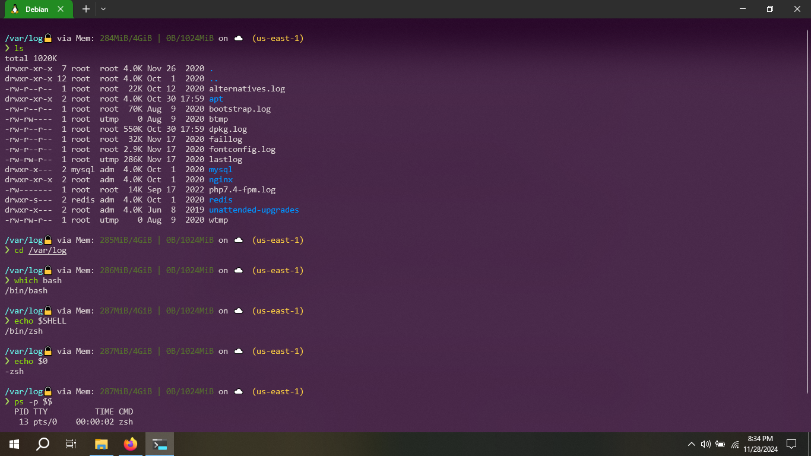

### File and Directory Operations

-Create a directory named linux_fundamentals in your home directory.
-Inside linux_fundamentals, create a subdirectory named scripts.
-Create an empty file named example.txt inside the linux_fundamentals directory.
-Copy example.txt to the scripts directory.
-Move example.txt from linux_fundamentals to linux_fundamentals/backup.

### Permissions
-Change the permissions of example.txt to read and write for the owner, and read-only for the group and others.
-Verify the permission changes using ls -l

```bash
mkdir ~/linux_fundamentals
mkdir ~/linux_fundamentals/scripts
touch ~/linux_fundamentals/example.txt
cp ~/linux_fundamentals/example.txt ~/linux_fundamentals/scripts/
mkdir ~/linux_fundamentals/backup
mv ~/linux_fundamentals/example.txt ~/linux_fundamentals/backup/
chmod 644 ~/linux_fundamentals/backup/example.txt
ls -l ~/linux_fundamentals/backup/example.txt
```

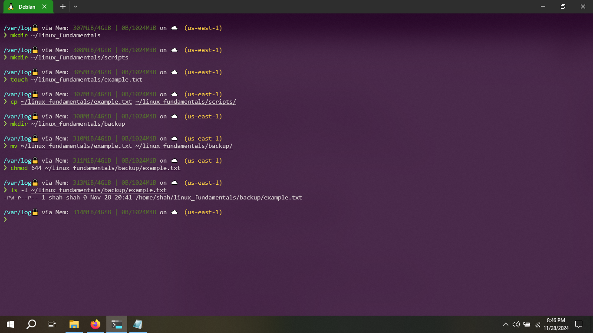

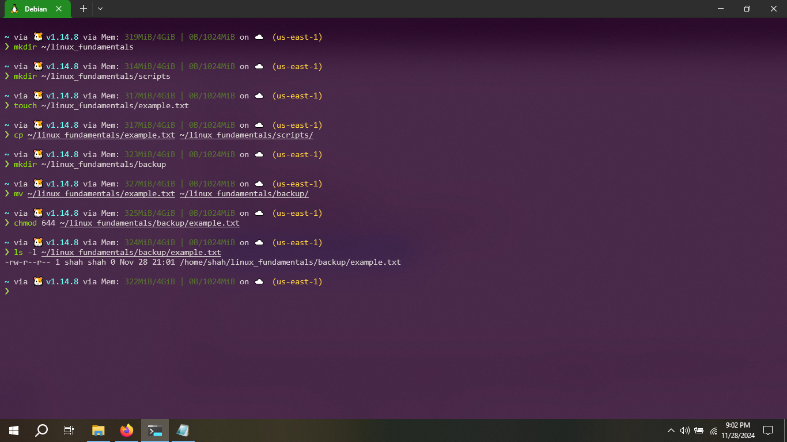

### File Modification

-Create a file named example.txt in your home directory.
-Change the owner of example.txt to a user named student
-Change the group of example.txt to a group named students.
-Verify the changes using appropriate commands.

```bash
touch ~/example.txt
sudo useradd student
sudo passwd student
grep student /etc/passwd
sudo chown student ~/example.txt
sudo groupadd students
getent group students
sudo chown :students ~/example.txt
ls -l ~/example.txt
```

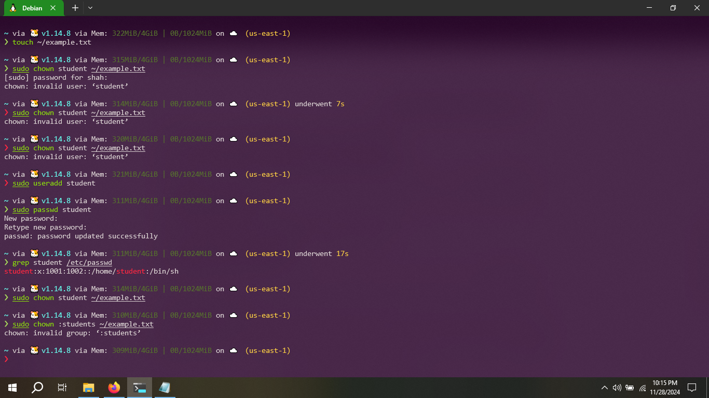

### Ownership

-Create a directory named project in your home directory.
-Create a file named report.txt inside the project directory.
-Set the permissions of report.txt to read and write for the owner, and read-only for the group and others.
-Set the permissions of the project directory to read, write, and execute for the owner, and read and execute for the group and others
-Verify the changes using appropriate commands.

```bash
mkdir ~/project
touch ~/project/report.txt
chmod 644 ~/project/report.txt
chmod 755 ~/project
ls -l ~/project/report.txt
ls -ld ~/project
```

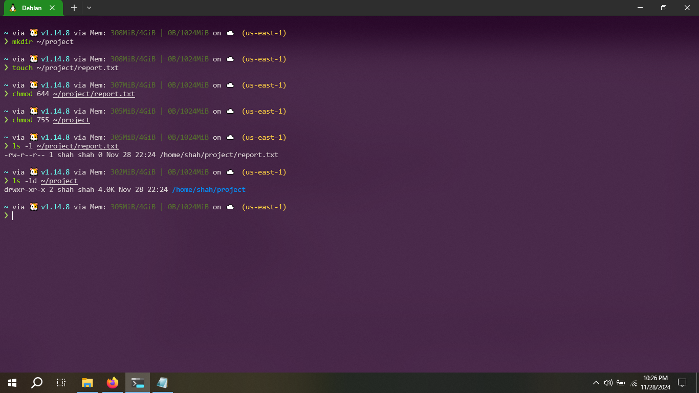

### User add/modify

-Create a new user named developer.
-Set the home directory of the user developer to /home/developer_home.
-Assign the shell /bin/sh to the user developer.
-Verify the new user's information.
-Change the username of the user developer to devuser.
-Add devuser to a group named devgroup.
-Set the password of devuser to devpass. ( hint: use passwd command. Run passwd --help to see available options)
-Verify the changes made to the user.

```bash
sudo useradd -m -d /home/developer_home -s /bin/sh developer
grep developer /etc/passwd
sudo usermod -l devuser developer
sudo groupadd devgroup
getent group devgroup
echo "devuser:devpass" | sudo chpasswd
grep devuser /etc/passwd
groups devuser
sudo -i -u devuser
```

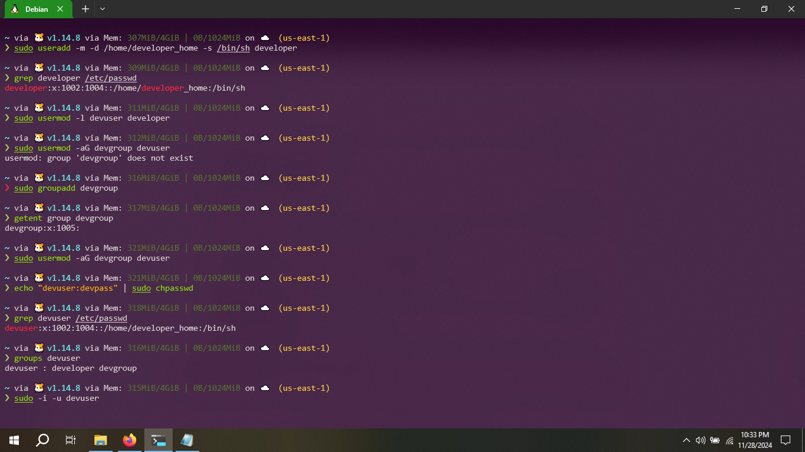

### Hard/Soft Link

-Create a file named original.txt in your home directory.
-Create a symbolic link named softlink.txt pointing to original.txt.
-Verify the symbolic link and ensure it points to the correct file.
-Delete the original file original.txt and observe the status of the symbolic link.
-Create a file named datafile.txt in your home directory.
-Create a hard link named hardlink.txt pointing to datafile.txt.
-Verify the hard link and ensure it correctly points to the file.
-Check the inode of both datafile.txt and hardlink.txt
-Delete the original file datafile.txt and observe the status of the hard link.
-Find all .txt files in your home directory. ( use find command. Run find --help for usage)

```bash
touch ~/original.txt
ln -s ~/original.txt ~/softlink.txt
ls -l ~/softlink.txt
rm ~/original.txt
ls -l ~/softlink.txt
touch ~/datafile.txt
ln ~/datafile.txt ~/hardlink.txt
ls -l ~/hardlink.txt
ls -i ~/datafile.txt ~/hardlink.txt
rm ~/datafile.txt
ls -l ~/hardlink.txt
find ~ -type f -name "*.txt"
```

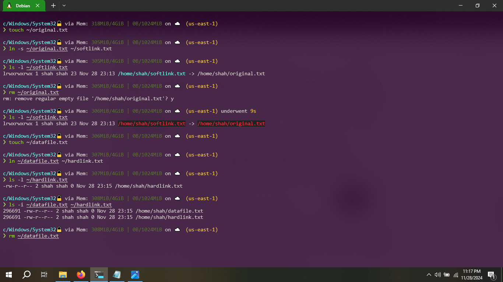

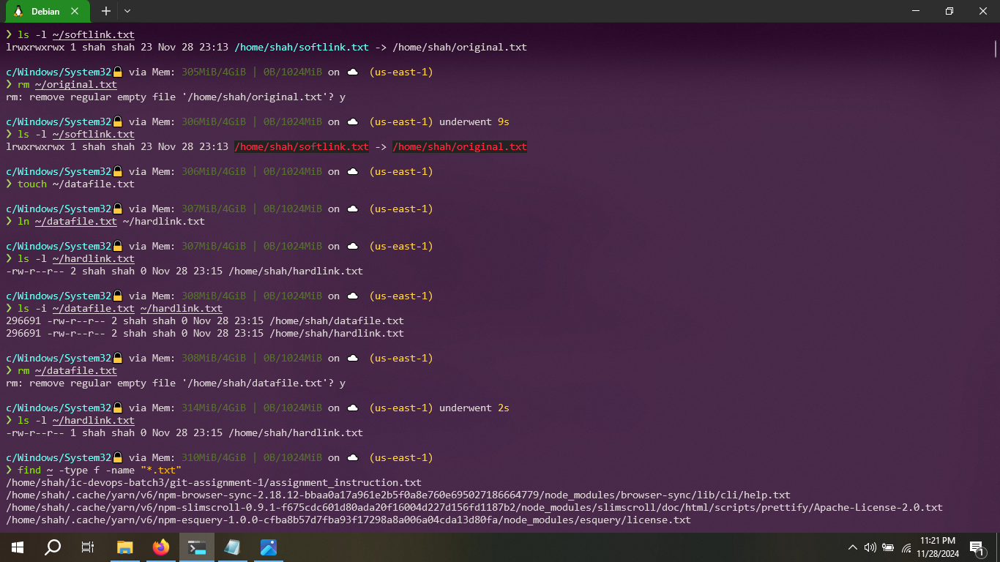

### Package installation

-Update repo cache using apt/apt-get
-Install a package named tree
-Install gcloud CLI tool using apt

```bash
sudo apt-get update
sudo apt install tree -ysudo apt install tree -y
sudo apt install tree -y
echo "deb [signed-by=/usr/share/keyrings/cloud.google.gpg] http://packages.cloud.google.com/apt cloud-sdk main" | sudo tee -a /etc/apt/sources.list.d/google-cloud-sdk.list
curl https://packages.cloud.google.com/apt/doc/apt-key.gpg | sudo tee /usr/share/keyrings/cloud.google.gpg
sudo apt update
sudo apt install google-cloud-cli -y
```

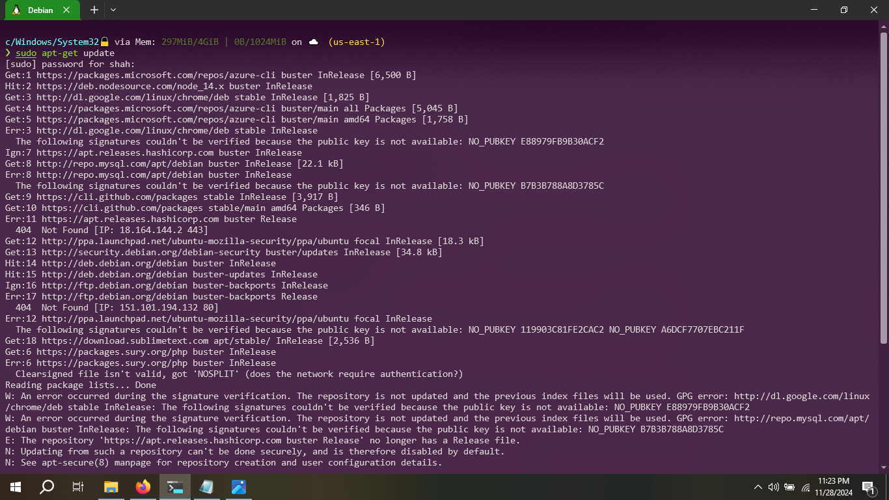

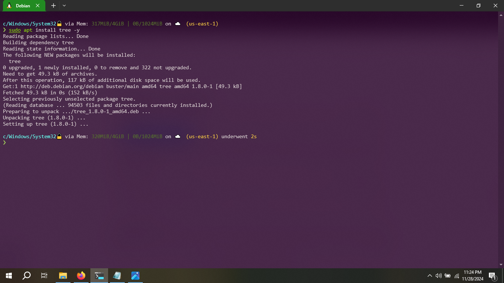

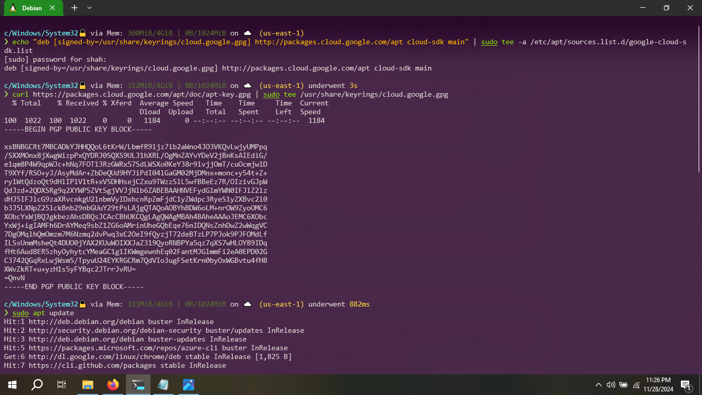

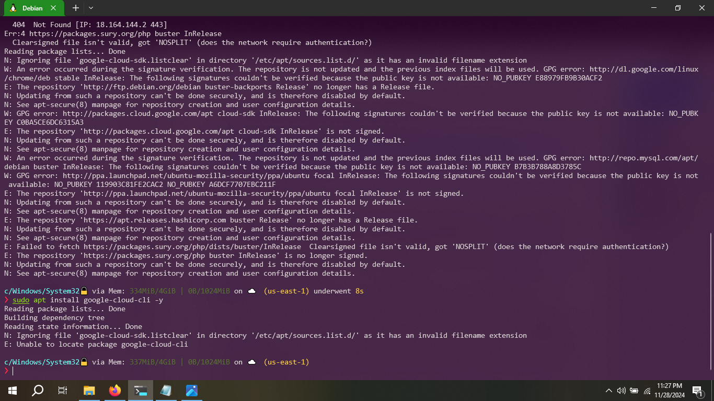


Thanks!