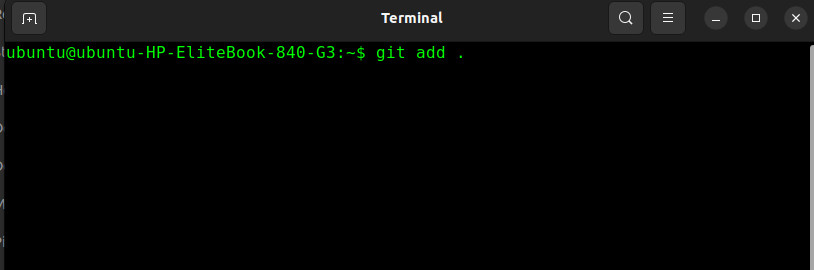

# GitHub Commands


## Basic git commands

Followings are the basic commands of git


```bash
git clone <remote-repository>

git add .
# or
git add <file-name>

git commit -m "<commit message>"
# or
git commit -m "<type>(<scope>): <short description>" -m "<commit details>" 
-m "<footer note>"

git push origin <branch-name>

git pull origin <branch-name>
```

And here are the screenshots of the following commands



Also we can highlight specific text

`git add .`

`git commit -m`

`git push`
