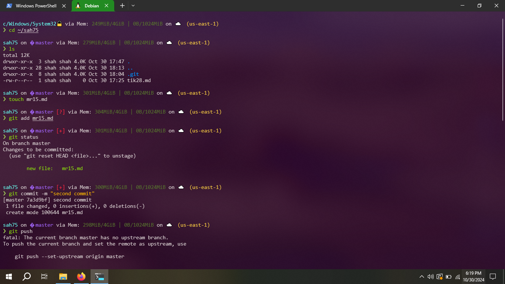
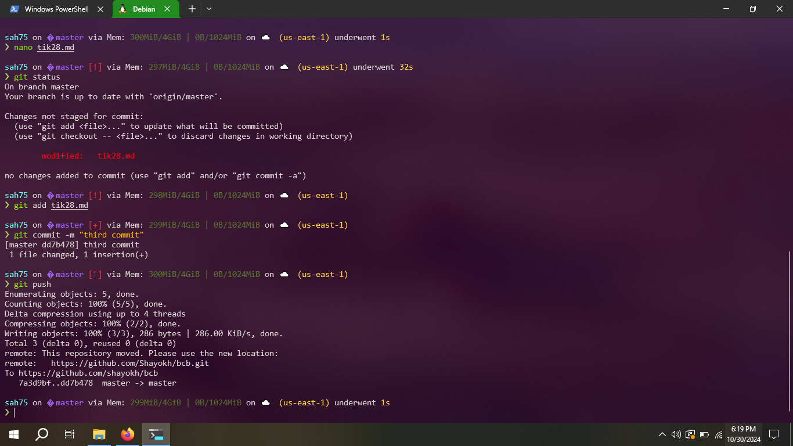
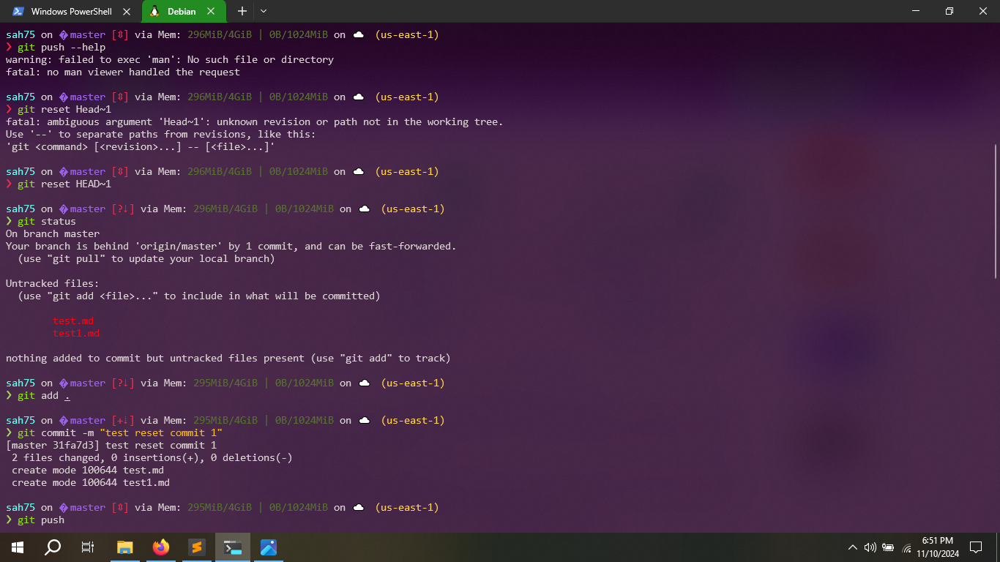
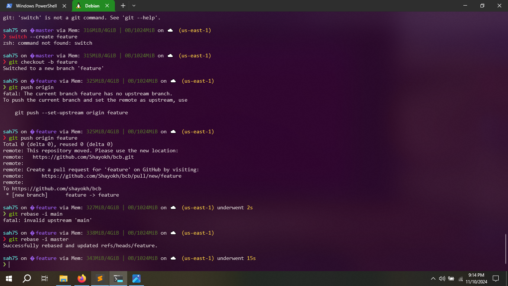

# Basic Git Commands

Hello there! I would like to share some git commands with some example here.

Here's some basic git commands.

## Making Directories

`mkdir FolderName`

## Removing Directories

`git rm -r FolderName`

## Creating File

`touch FileName`

## Git Clone

`git clone <remote-repository>`

## Git Add (Staging)

`git add.`

## Git Commit

`git commit -m <commit message`

## Pushing changes from Local to Main/Branch

`git push origin <branch name`

#### Screenshots of the above commands are as follows:





## Git Reset

The git reset command is used to undo the changes in your working directory and get back to a specific commit while discarding all the commits made after that one. It has three primary forms of invocation. These forms correspond to command line arguments `--soft`, `--mixed`, `--hard`

```bash
git reset [--soft | --mixed [-N] | --hard | --merge | --keep] [-q] [<commit>]
```


## Git Rebase

Let's assume you have a `feature` branch with some commits, and you want to rebase it on top of the `main` branch to keep your history linear.

```bash
git checkout feature
git rebase -i main
```



## Merge

Assume you have two branches: `main` and `feature-branch`. You want to merge the changes from `feature-branch` into `main`.

```bash
cd /path/to/your/repo
git pull origin main
git merge feature-branch
```

## PR Review
In Git, a pull request (PR) review is a process where collaborators review changes made to a codebase before they are merged into the main branch.

## Pull Request
A pull request is a proposal to merge a set of changes from one branch into another. In a pull request, collaborators can review and discuss the proposed set of changes before they integrate the changes into the main codebase. Pull requests display the differences, or diffs, between the content in the source branch and the content in the target branch.

Thanks!